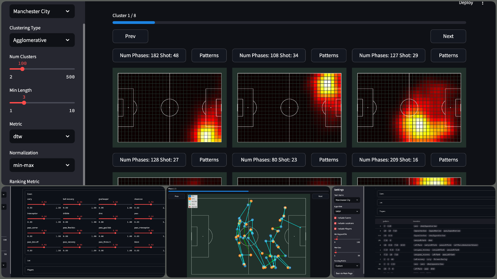

# Football-Tactical-Pattern-Recognition
### Introduction

This project is part of my Bachelor of Science (B.Sc) thesis, aimed at leveraging data mining techniques to analyze football tactics. 

With the growing availability of sports data, particularly in football, automated tools are increasingly important for analyzing various game aspects. In this comparison-based study, I developed a system to detect offensive tactical patterns used by football teams. The system processes event-based football data, breaking it down into phases that are clustered based on spatial characteristics. The clustering is performed using the K-means algorithm combined with the Dynamic Time Warping (DTW) distance measure, which was found to be the most effective combination for clustering sequences. After clustering, the phases are analyzed using pattern mining techniques. The Vertical Maximal Sequential Pattern (VMSP) algorithm is employed to extract frequently occurring patterns, which are then ranked by relevance.

A **visual dashboard** is included in the project, allowing users to interactively explore the results. Users can select different algorithms for each component of the system, including clustering and pattern mining, enabling a flexible comparison of different methods and their outcomes.



### FTPR Package

The **FTPR** (Football Tactical Pattern Recognition) package is a core component of this project, providing key functionality for preprocessing, clustering, and mining patterns from football event data. It is designed to be modular and flexible, enabling users to apply a variety of algorithms to analyze football tactics.

**Key Features:**

* **Preprocessing**: The package provides utilities for transforming raw football event data into structured formats, segmenting it into phases for deeper analysis.
  
* **Clustering**: Multiple clustering algorithms with different distance functions are supported, including:
  - **K-means** combined with the **Dynamic Time Warping (DTW)** distance measure, for grouping phases based on spatial and temporal characteristics.
  - **Agglomerative Hierarchical Clustering**, which allows for grouping phases in a tree-like structure, providing a different approach to discovering similarities between sequences.
  
* **Pattern Mining**: The package implements pattern mining techniques to detect frequent tactical sequences, with support for:
  - **Vertical Maximal Sequential Pattern (VMSP)**, an efficient algorithm for finding maximal frequent sequential patterns allowing to find a compact representation of tactics.
  - **CM-SPADE**, a highly efficient algorithm for mining frequent sequences, offering another option for users to extract meaningful tactical patterns from football data.

* **Visualization**: FTPR includes visualization tools to represent clustering results and mined patterns, facilitating a clearer understanding of tactical insights.
						

### Installation

Follow the steps below to install the necessary components for running this project:

**1. Install FTPR Package**

First, install the **FTPR** package by navigating to the ftpr directory and running the following command:

```bash
cd ftpr
pip3 install .
```

**2. Install Other Dependencies**

```bash
pip3 install -r requirements.txt
```

**3. Download SPMF**

Download the **SPMF** tool, a Java-based application for running sequence mining algorithms, from the [official website](https://www.philippe-fournier-viger.com/spmf/index.php?link=download.php). After downloading, place the **spmf.jar** file in the root directory of the project.

### Usage

This project utilizes Statsbomb's ball-event data, specifically focusing on the Premier League 2015/16 dataset. Follow the following steps to run the project:

**1. Download the data**

To download a Statsbomb dataset you can either use `download_data.py` script or run `notebook/download_data.ipynb` notebook.

An example usage of download data script would be like this:

```bash
python3 download_data.py --data-dir data \
                         --events-dir events \
                         --competition-id 2 \
                         --season-id 27
```

`--data-dir`: The root directory of data.

`--events-dir`: The subdirectory of events within the root directory of data.

`--competition-id`: The competition id of the Statsbomb dataset.

`--season-id`: The season id of the Statsbomb dataset.

Alongwith the events, `player.pkl` file containing a dictionary of all players of all clubs will be stored in the root directory of data. Another file is `matches.csv` which contains the information of all matches in the dataset.

**2. Extract the Phases**

To extract the team phases you can use `extract_teams_phases.py` script. You can use this script as follows:

```bash
python3 extract_teams_phases.py --matches data/matches.csv \
                                --events data/events \
                                --output-dir data/team_phases
```

`--matches`: The path to `matches.csv` file.

`--events`: The path to subdirectory of events within the root directory of data.

`--output-dir`: The directory where the phases will be saved in.

**3. Run the Dashboards**

There are 2 dashboards available in this project. The first one `dashboard/main.py` is the main dashboard where you can run clustering and sequence mining algorithms. The second one `dashboard/phases.py`.

To run the main dashboard simply run:

```bash
cd dashboard
python3 -m streamlit run main.py -- --rows 4 --cols 3 \
                                 --players-path ../data/players.pkl \
                                 --matches-path ../data/matches.csv \
                                 --spmf-dir ..
```

`--rows`: Number of rows of clusters shown in each page.

`--cols`: Number of columns of clusters shown in each page.

`--players-path`: The path to `players.pkl` file.

`--matches-path`: The path to `matches.csv` file.

`--spmf-dir`: The path to `spmf.jar` file.

To run the phases dashboard simply run:

```bash
cd dashboard
python3 -m streamlit run phases.py -- --phases-dir ../data/team_phases \
                                 --matches-path ../data/matches.csv
```

`--phases-dir`: The directory where the phases are saved in.

`--matches-path`: The path to `matches.csv` file